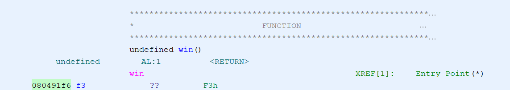

# buffer overflow 1
## Author
Sanjay C / Palash Oswal
## Description
Control the return address Now we're cooking! You can overflow the buffer and return to the flag function in the [program](./vuln). You can view source [here](./vuln.c). And connect with it using `nc saturn.picoctf.net 63077`
## Hints
1. Make sure you consider big Endian vs small Endian.
2. Changing the address of the return pointer can call different functions.
## Approach
Read [`vuln.c`](./vuln.c) and notice the win function gives the flag.  
Opening [`vuln`](./vuln) with [Ghidra](https://ghidra-sre.org/), navigating to functions, then searching for the win function is the way to get the return address to the win function.  
  
Run [`script.py`](./script.py) to solve the challenge. [pwntools](https://docs.pwntools.com/en/stable/) is a Python library that's really useful for solving pwn (binary exploitation). The code connects to the shell, then writes 44 "a"s and sends the address of the win function.
~~I don't know where 44 came from, that was obtained through trial and error~~
## Flag
picoCTF{addr3ss3s_ar3_3asy_60fac6aa}