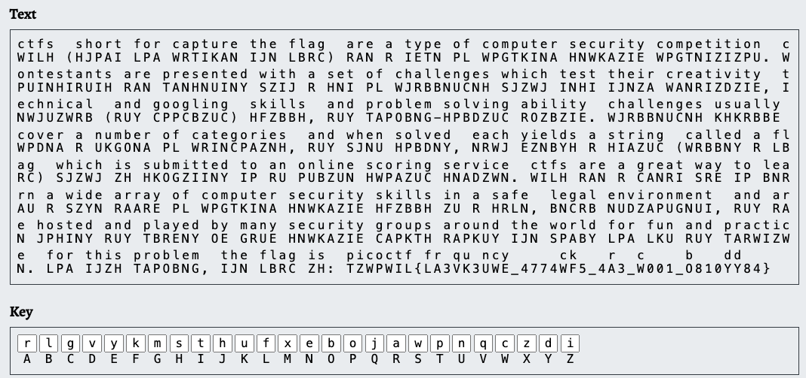

# substitution1

## Author

WILL HONG

## Description

A second message has come in the mail, and it seems almost identical to the first one. Maybe the same thing will work again.
Download the message [here](./message.txt).

## Hints

1. Try a frequency attack
2. Do the punctuation and the individual words help you make any substitutions?

## Approach

I searched up a substitution cipher solver and found [this website](https://www.boxentriq.com/code-breaking/cryptogram)
Clicking Auto Solve, the first option seemed to be correct so I tried the flag and it worked.

Note: Trying it again, the Q in "FR3QU3NCY" was always a q but you can guess what the word is supposed to be. 

## Flag

picoCTF{FR3QU3NCY_4774CK5_4R3_C001_B810DD84}
