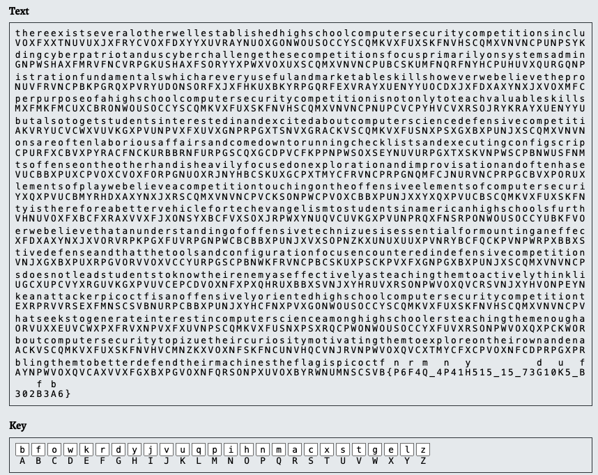

# substitution2

## Author

WILL HONG

## Description

It seems that another encrypted message has been intercepted. The encryptor seems to have learned their lesson though and now there isn't any punctuation! Can you still crack the cipher?
Download the message [here](./message.txt).

## Hints

1. Try refining your frequency attack, maybe analyzing groups of letters would improve your results?

## Approach

Using the same [website](./https://www.boxentriq.com/code-breaking/cryptogram) as substritution1, I found the flag.

## Flag

picoCTF{n6r4m_4n41y515_15_73d10u5_f302f3b6}
