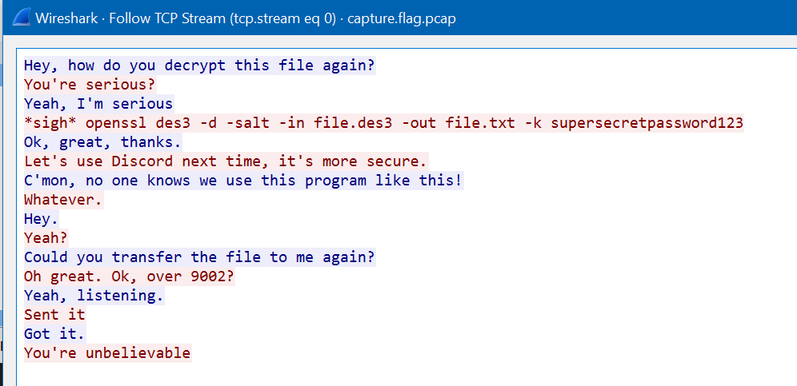

# Eavesdrop
## Author
LT 'syreal' Jones
## Description
Download this packet capture and find the flag.
* [Download packet capture](./capture.flag.pcap)
## Hints
1. All we know is that this packet capture includes a chat conversation and a file transfer.
## Approach
My first step was opening the packet capture in [Wireshark](https://www.wireshark.org/). On port 9001, there's conversations happening in the TCP stream so right click, Follow > TCP Stream for one of the packets on port 9001:  
  
My next thought was the packet itself would contain this file but there weren't any files to export from this packet capture. I then realized the file transfer doesn't have to be through the network and since this is a forensics challenge, the file might just be within the packet capture file.  
Running `binwalk capture.flag.pcap` got:
```
DECIMAL       HEXADECIMAL     DESCRIPTION
--------------------------------------------------------------------------------
0             0x0             Libpcap capture file, little-endian, version 2.4, Ethernet, snaplen: 262144
5882          0x16FA          OpenSSL encryption, salted, salt: 0x3A915E72C0FB75F
``` 
meaning there is indeed another file hidden inside. I used `binwalk --dd=".*" capture.flag.pcap` to extract the files, navigated to the folder it extracted the files to, then renamed the OpenSSL file to [`file.des3`](./file.des3). Now we can use the command provided in the packet capture: `openssl des3 -d -salt -in file.des3 -out file.txt -k supersecretpassword123`. This produces a new file `file.txt` in the same folder. Opening [`file.txt`](./file.txt) with a text editor will get the flag.
## Flag
picoCTF{nc_73115_411_77b05957}