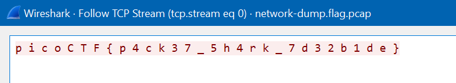

# Packets Primer
## Author
LT 'syreal' Jones
## Hints
1. Wireshark, if you can install and use it, is probably the most beginner friendly packet analysis software product.
## Description
Download the packet capture file and use packet analysis software to find the flag.
* [Download packet capture](./network-dump.flag.pcap)
## Approach
There are a few packet analysis tools that exist but I usually use [Wireshark](https://www.wireshark.org/). After opening the packet in Wireshark, we see there are 5 packets. Right click the first one, Follow > TCP Stream and it shows this:

## Flag
picoCTF{p4ck37_5h4rk_7d32b1de}