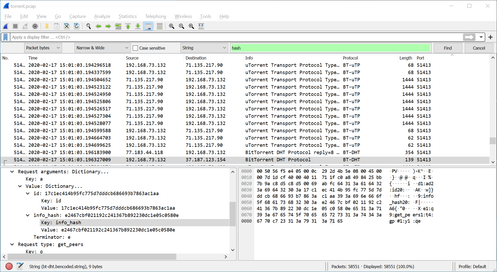

# Torrent Analyze
## Author
Mubarak Mikail
## Description
SOS, someone is torrenting on our network. One of your colleagues has been using torrent to download some files on the company’s network. Can you identify the file(s) that were downloaded? The file name will be the flag, like `picoCTF{filename}`. [Captured traffic](./torrent.pcap).
## Hints
1. Download and open the file with a packet analyzer like [Wireshark](https://www.wireshark.org/).
2. You may want to enable BitTorrent protocol (BT-DHT, etc.) on Wireshark. Analyze -> Enabled Protocols
3. Try to understand peers, leechers and seeds. [Article](https://www.techworm.net/2017/03/seeds-peers-leechers-torrents-language.html)
4. The file name ends with `.iso`
## Approach
Following hints 1 and 2 is good. After that, I started searching for "iso" in the strings. That didn't work well so I had to switch strategies. All files have a [unique hash](https://en.wikipedia.org/wiki/File_verification) (or [should have a unique hash](https://en.wikipedia.org/wiki/Hash_collision)) so my next attempt was to search "hash":  
  
I found 4 different hashes:
```
e2467cbf021192c241367b892230dc1e05c0580e
7af6be54c2ed4dcb8d17bf599516b97bb66c0bfd
17c0c2c3b7825ba4fbe2f8c8055e000421def12c
17c02f9957ea8604bc5a04ad3b56766a092b5556
```
I tried searching up each hash, the last 3 had nothing come up. Searching 'e2467cbf021192c241367b892230dc1e05c0580e ".iso"' got [this website](https://linuxtracker.org/index.php?page=torrent-details&id=e2467cbf021192c241367b892230dc1e05c0580e) for torrenting the `ubuntu-19.10-desktop-amd64.iso` file.
## Flag
picoCTF{ubuntu-19.10-desktop-amd64.iso}